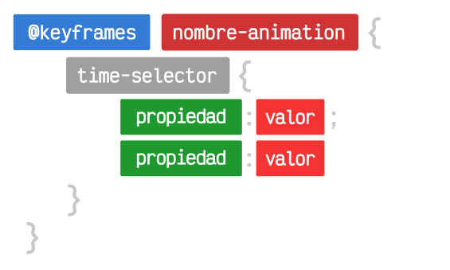
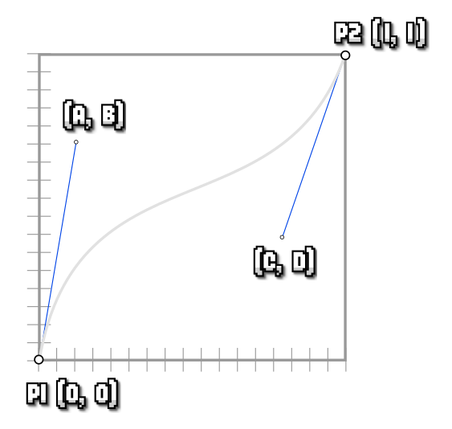

# Animaciones en css

## Transiciones CSS

Como vimos en el apartado de selectores, podemos utilizar pseudoclases como :hover para cambiar los estilos cuando el usuario mueva el ratón sobre el elemento HTML que tiene dicha pseudoclase. Esto provoca un cambio de estilo, y le da al usuario la confirmación de que está preparado para confirmar una selección o acceder a una nueva sección.

En CSS aparecen uno de los aspectos más interesantes de una web interactiva: las transiciones. Hasta ahora, al utilizar una pseudoclase como :hover, el cambio de estilos ocurría de golpe, pasando de un estado inicial a otro final. Utilizando transiciones tenemos a nuestra disposición una gran flexibilidad que nos permitirá dotar de atractivos efectos de transición que harán que nuestros diseños sean más elegantes y agradables.

Las transiciones se basan en un principio muy básico: conseguir un efecto suavizado entre un estado inicial y un estado final al realizar una acción.

| Propiedades                | Descripción                                  | Valor                      |
| -------------------------- | -------------------------------------------- | -------------------------- |
| transition-duration        | Tiempo de duración.                          | 0 - time                   |
| transition-property        | Propiedades CSS afectadas por la transición. | all - none - propiedad css |
| transition-timing-function | Ritmo de la transición.                      |                            |
| transition-delay           | Tiempo de retardo inicial.                   | 0                          |

```
Ten en cuenta que por defecto las transiciones están habilitadas para todas las propiedades CSS involucradas. Sin embargo, tienen una duración de 0s. Salvo que cambiemos esta duración, no se realizará transición.
```

Veamos como funciona cada una de estas propiedades detalladamente:

### La propiedad transition-duration

Con la propiedad transition-duration especificaremos la duración de la transición, desde el inicio de la transición, hasta su finalización. Recuerda que por defecto, las transiciones tienen una duración de 0s, por lo que si no cambias este valor, cambiará de golpe y será lo mismo que no tener transición.`

```CSS
.element {
  transition-duration: 0.5s;
  width: 200px;
  height: 200px;
  background: grey;
}

.element:hover {
  background: indigo;
}
```

```HTML
<div class="element"></div>
```

```
Ojo: Si establecemos una duración demasiado alta, el navegador realizará la transición a trozos intermitentes, lo que hará que se vea a golpes. Se recomienda siempre comenzar con valores cortos, para que las transiciones sean rápidas y elegantes.
```

### La propiedad transition-property

En primer lugar, la propiedad transition-property se utiliza para especificar la propiedad a la que que afectará la transición. Podemos especificar la propiedad concreta (width o color, por ejemplo) o simplemente especificar all para que se aplique a todos los elementos con los que se encuentre. Por otro lado, none hace que no se aplique ninguna transición.

| Propiedades   | Valor                                                           |
| ------------- | --------------------------------------------------------------- |
| all           | Aplica la transición a todas las propiedades css.               |
| none          | No aplica transición. El cambio se producirá de golpe (brusco). |
| propiedad css | Aplica la transición sólo a la propiedad css especificada.      |

Ten en cuenta que para la transición se efectue correctamente, deberíamos tener un estado inicial y un estado final, en caso contrario, el navegador podría no saber uno de esos estados y por lo tanto, no podría efectuar la transición. En algunos casos no será necesario el estado inicial puesto que tomará el valor por defecto en ese caso.

Ten en cuenta que puedes animar todas las propiedades CSS afectadas utilizando all:

```CSS
.element {
  /* Primer ejemplo: Anima todas las propiedades que cambien de estado */
  transition-property: all;
  transition-duration: 1s;

  /* Segundo ejemplo: Anima sólo el ancho, el resto no transicionan, cambian de golpe */
  transition-property: width;
  transition-duration: 1s;
}
```

```
Nota: Debes saber que no todas las propiedades CSS son animables (o transicionables). Por norma general, la mayoría de las propiedades que son cuantificables (valores numéricos, porcentajes, valores hexadecimales como colores, etc...) son animables, sin embargo, otras propiedades no lo son. Por ejemplo, la propiedad background-image para gradientes no se puede animar actualmente.
```

### La propiedad transition-delay

Por último, la propiedad transition-delay nos ofrece la posibilidad de retrasar el inicio de la transición un número de segundos determinado. Si se omite, la transición comienza inmediatamente.

Veamos un pequeño ejemplo de todas estas propiedades de transición. Utilizaremos la función de tiempo linear, que explicaremos en el próximo capítulo:

```CSS
    a {
    display: inline-block;
    background: #ddd;
    color: #222;
    padding: 8px 16px;

    transition-property: all;
    transition-duration: 0.5s;
    transition-timing-function: linear;
    }

    a:hover {
    background: #fff;
    color: darkred;
    padding: 32px;
    border: 1px solid darkred;
    }
```

```HTML
    <a href="https://google.com/">Google.com</a>
```

En este ejemplo, con all hemos determinado animar todas las propiedades que cambien:

- La propiedad background de color de fondo cambiará de #ddd a #fff
- La propiedad color de color de texto cambiará de #222 a #666
- La propiedad padding del tamaño del relleno cambiará de 8px a 25px
- La propiedad border cambiará de 0 a 1px solid #888.

Este último es un caso especial, puesto que cambia de estilos porque toma el estilo inicial por defecto, que es un borde de 0px de grosor. Cada una de estas transiciones se realizarán a un ritmo lineal, durante 0.5s de duración.

### Atajo: La propiedad transition

Como siempre, podemos resumir todas estas operaciones en una propiedad de atajo denominada transition. Los valores del ejemplo superior, se podrían escribir como se puede ver a continuación (si no necesitas algún valor, se puede omitir):

```CSS
.box {
  /* transition: <property> <duration> <timing-function> <delay> */
  transition: all 0.5s linear;

  background: grey;
  width: 200px;
  height: 200px;
}

.box:hover {
  background: indigo;
}

```

```HTML
<div class="box"></div>
```

Observa que estamos omitiendo el último valor. Si quisieramos un retardo de 2s a la hora de hacer una transición, bastaría con añadir un 2s después de linear.

### Transiciones de entrada y salida

Aprovechando la cascada de CSS, podemos hacer transiciones de entrada y salida diferentes.

Si nos fijamos bien, la transición del ejemplo anterior se aplica sólo al mover el ratón sobre el elemento (transición de entrada). Sin embargo, si movemos el ratón fuera del enlace, no se produce transición, sino que realiza el cambio de forma brusca. Esto ocurre porque le estamos diciendo que solo realice la transición cuando tenemos el ratón encima (:hover), en caso contrario no lo hará porque no hay definidas propiedades de transición.

Si movemos las propiedades de transición al primer bloque, se aplicarán tanto en las transiciones de entrada como en las transiciones de salida. Por otro lado, si indicamos unas propiedades transition-\* en a y otras en a:hover con diferentes valores, podremos conseguir (por ejemplo) duraciones diferentes.

```CSS
a {
  background: black;
  color: white;
  padding: 8px;
  transition: background 0.2s linear;
}

a:hover {
  background: red;
  transition: background 2s linear;
}
```

En este caso, cuando mueves el ratón encima del enlace, la transición tardará 2 segundos en ponerse en rojo. Sin embargo, cuando quitemos el ratón del elemento, se producirá en 0.2 segundos ya que se efectua la transición del primer bloque.

¡Recuerda siempre tener cuidado con la herencia, cascada y especificidad!

### Transiciones diferentes

También es posible que queramos indicar, por ejemplo, diferentes duraciones dependiendo de la propiedad CSS. Por ejemplo, que tarde mucho en cambiar el ancho del elemento, pero muy poco en cambiar el color de fondo.

Para ello, podemos separar con comas las diferentes propiedades que queremos transicionar:

```CSS
    .box {
    width: 200px;
    height: 200px;
    background: grey;
    transition:
        width 3s,
        background-color 0.5s;
    }

    .box:hover {
    width: 400px;
    background: deeppink;
    }
```

```HTML
    <div class="box"></div>
```

De esta forma, la transición de la propiedad width tardará 3 segundos en cambiar, mientras que la del color de fondo tardará sólo 0.5s.

## Animaciones CSS

Una vez conocemos las transiciones CSS, es muy fácil adaptarnos al concepto de animaciones CSS, el cual amplia lo que ya sabemos de transiciones, convirtiéndolo en algo mucho más flexible y potente, en el que no es necesario que el usuario interactue de alguna forma (cómo pasa en las transiciones).

Las transiciones son una manera de suavizar un cambio de un estado inicial a un estado final. La idea de las animaciones CSS parten del mismo concepto, pero a diferencia de las transiciones, permiten añadir más estados aún. Así pues, con las animaciones podemos partir desde un estado inicial, a un estado posterior, a otro estado posterior, y así sucesivamente.

Para crear animaciones CSS es necesario realizar 2 pasos:

- Utilizar la propiedad animation (o derivadas) para indicar que elemento HTML vamos a animar.
- Definir mediante la regla @keyframes la animación en cuestión y sus estados (fotogramas clave).

En primer lugar, vamos a examinar las diferentes propiedades relacionadas con las animaciones, y más adelante veremos como crear fotogramas con la regla @keyframes.

### Propiedades de animación CSS

Para el comportamiento de una animación, necesitamos conocer las siguientes propiedades, que son una «ampliación» de las propiedades de las transiciones CSS:

| Propiedad                 | Descripción                       | Valor                                            |
| ------------------------- | --------------------------------- | ------------------------------------------------ |
| animation-name            | Nombre de la animación a aplicar. | none - nombre                                    |
| animation-duration        | Duración de la animación.         | 0 - TIME                                         |
| animation-timing-function | Ritmo de la animación.            | Ver funciones de tiempo                          |
| animation-delay           | Retardo en iniciar la animación.  | 0 - TIME                                         |
| animation-iteration-count | Número de veces que se repetirá.  | 1 - infinite - NUMBER                            |
| animation-direction       | Dirección de la animación.        | normal - reverse - alternate - alternate-reverse |
| animation-fill-mode       | Como se «completa» la animación.  | none - forwards - backwards - both               |
| animation-play-state      | Estado de la animación.           | running - paused                                 |

En las siguientes secciones explicaremos detenidamente cada una de estas propiedades y su funcionamiento.

### Nombre de la animación

La propiedad principal de las animaciones es animation-name, ya que esta permite especificar el nombre de la animación (definido con la regla @keyframes que veremos más adelante) que queremos asociar al elemento HTML donde indicamos la propiedad. El nombre de la animación debería estar en kebab-case (y no en camelCase u otras).

- La propiedad animation-duration establece el tiempo de duración de la animación.
- La propiedad animation-delay establece el retardo en empezar la animación.
- La propiedad animation-timing-function establece el ritmo de la animación.

```
Las propiedades animation-duration y animation-delay funcionan exactamente igual que las propiedades análogas transition-duration y transition-delay del apartado de Transiciones CSS. De igual forma, la propiedad animation-timing-function es idéntica a la propiedad transition-timing-function que explicamos en el apartado de Funciones de tiempo.
```

### Número de repeticiones

La propiedad animation-iteration-count permite indicar el número de veces que se repite la animación, pudiendo establecer un número concreto de repeticiones o indicando infinite para que se repita continuamente.

### Dirección de la animación

Por otra parte, especificando un valor en animation-direction conseguiremos indicar el orden en el que se reproducirán los fotogramas, pudiendo escoger un valor entre los siguientes:

| Valor             | Significado                                                                     |
| ----------------- | ------------------------------------------------------------------------------- |
| alternate-reverse | En iteraciones par, se reproducen como reverse. En impares, como normal.        |
| normal            | Los fotogramas se reproducen en orden: desde el primero hasta el último.        |
| reverse           | Los fotogramas se reproducen en orden inverso: desde el final hasta el primero. |
| alternate         | En iteraciones par, se reproducen como normal. En impares, como reverse.        |

### Modo de completado

Por defecto, una animación antes de arrancar y después de terminar (si no está establecida en repetición infinite) no tiene aplicados los estilos de la animación especificada en cuestión. Esto se puede ver fácilmente, por ejemplo, cuando termina una animación, que vuelve a sus «estilos iniciales».

Mediante la propiedad animation-fill-mode podemos indicar que debe hacer la animación cuando no se está reproduciendo:

- El valor none realiza el comportamiento indicado en el párrafo anterior.
- El valor backwards indica que la animación debe tener aplicados los estilos del fotograma inicial antes de empezar.
- El valor forwards indica que la animación debe tener aplicados los estilos del fotograma final al terminar.
- El valor both indica que debe aplicar los dos casos anteriores (backwards y forwards).

### Estado de la animación

Por último, la propiedad animation-play-state nos permite establecer la animación a estado de reproducción running o pausarla mediante el valor paused. Esto en CSS no da demasiadas posibilidades, pero puede ser muy útil combinado con algo de Javascript.

### Atajo: Animaciones

Nuevamente, CSS ofrece la posibilidad de resumir todas estas propiedades en una sola, para hacer nuestras hojas de estilos más compactas. El orden recomendado para los valores de la propiedad de atajo sería el siguiente:

```CSS
.animated {
  /* animation: <name> <duration> <timing-function> <delay>
                <iteration-count> <direction> <fill-mode> <play-state> */

  animation:
    change-color 5s linear 0.5s 4 normal forwards running;
}
```

```
OJO: Mucho cuidado al indicar los segundos en las propiedades animation-duration y/o animation-delay. Si no indicamos la unidad (incluso con valores de cero), se interpretará como el valor de la propiedad animation-iteration-count, que es el número de veces que se repite la animación (y no lleva unidad).
```

### Animaciones múltiples

Como en muchas propiedades de CSS, es posible separar por comas para indicar múltiples valores, en este caso, para indicar que queremos realizar varias animaciones a la vez. En este ejemplo, indicamos que tanto la animación move-right como la animación change-color deben empezar a la vez, cada una de las cuales dura 5 segundos y tienen un ritmo lineal (constante):

```CSS
.animated {
  animation:
    move-right 5s linear,
    change-color 5s linear;
}
```

Sin embargo, si además añadimos la propiedad animation-delay, podemos hacer algo muy interesante.

### Encadenar animaciones

Es posible encadenar animaciones utilizando animaciones múltiples combinadas con la propiedad animation-delay. Observa el siguiente ejemplo donde se verá mucho mejor:

```CSS
.animated {
  animation:
    move-right 5s linear 0s,   /* Comienza a los 0s (no hay anterior) */
    look-up 2.5s linear 5s,    /* Comienza a los 5s (5 de la anterior) */
    move-left 5s linear 7.5s,  /* Comienza a los 7.5s (5 + 2.5 de la anterior) */
    dissapear 2s linear 9.5s;  /* Comienza a los 9.5s (5 + 2.5 + 2 de la anterior) */
}
```

El truco de este ejemplo está en los valores de duración y los de retardo, en combinación con los anteriores:

- La primera animación move-right comienza a los 0 segundos y dura 5 segundos.
- La segunda animación look-up comienza a los 5 segundos y dura 2.5 segundos.
- La tercera animación move-left comienza a los 7.5 segundos y dura 5 segundos.
- La cuarta animación dissapear comienza a los 9.5 segundos y dura 2 segundos.
  En este caso, lo que hemos hecho es aplicar varias animaciones a la vez, pero estableciendo un retardo (cuarto parámetro) que es la suma de la duración de las animaciones anteriores. De esta forma, encadenamos una animación con otra.

## La regla @keyframes

Cuando ya hemos utilizado propiedades CSS como animation (o de su familia, animation-\*), nos falta una parte muy importante: definir los fotogramas de la animación.

Una animación esta formada por varios fotogramas, una secuencia de imágenes (30-60 fotogramas por segundo, por ejemplo) que mostradas una detrás de otra generan el efecto de movimiento que conocemos de una animación. En CSS, los fotogramas se crean a partir de propiedades CSS, y no hace falta definir tantos fotogramas. Sólo crearemos fotogramas clave y el resto de fotogramas los generará el navegador.

Para definir esos fotogramas clave, utilizaremos la regla @keyframes, la cuál es muy sencilla de utilizar. Se basa en el siguiente esquema:



Cada uno de estos time-selector será un momento clave de cada uno de los fotogramas clave de nuestra animación, y ya veremos que pueden definirse muchos en una misma animación.

### Selectores from y to

Como vemos, dicha sintaxis tiene dos partes interesantes, ya que las reglas (propiedad, valor) ya las conocemos en CSS. Las partes principales por las que debemos comenzar son:

| Parte           | Descripción                                                                  |
| --------------- | ---------------------------------------------------------------------------- |
| @keyframes name | Regla para darle un nombre y definir los fotogramas clave de una animación.  |
| from            | Fotograma clave inicial con los estilos CSS a aplicar. Equivalente a 0%.     |
| to              | Fotograma clave final con los estilos CSS a aplicar. Equivalente a 100%.     |
| Porcentaje      | especifíco de la animación con los estilos CSS a aplicar. Permite decimales. |

Esto siempre se ve mejor con un ejemplo, así que vamos a mostrarlo:

```CSS
@keyframes change-color {
  from { background: red; }  /* Primer fotograma */
  to { background: green; }  /* Segundo y último fotograma */
}
```

Como vemos, hemos nombrado change-color la animación, que parte de un primer fotograma clave con el fondo rojo hasta un último fotograma clave con fondo verde.

```
Cuidado con olvidarse de la s final de @keyframes, ya que está en plural. Respecto al nombre de la animación, lo recomendable es utilizar kebab-case a la hora de nombrarla y que represente bien lo que hace.
```

Recuerda que no basta con definir la animación mediante @keyframes, también que hay que asociar la animación al elemento o etiqueta HTML al que queremos aplicársela:

```CSS
.element {
  width: 100px;
  height: 100px;
  animation: change-color 1.5s linear infinite;
}

@keyframes change-color {
  from { background: red; }  /* Primer fotograma */
  to { background: green; }  /* Segundo y último fotograma */
}
```

```HTML
<div class="element"></div>
```

La magia de la regla @keyframes es que nosotros solo declaramos los fotogramas clave, mientras que el navegador irá generando los fotogramas intermedios para conseguir una animación fluida.

```
Truco: Si una animación va a golpes, es muy posible que te hayas pasado con el tiempo de duración de la misma. Intenta utilizar valores bajos como 0.25s, 0.5s, 1s y no valores mucho más altos.
```

### Selectores porcentuales

Los selectores from y to son muy similares a colocar 0% y 100%, así que los modificaremos y de esta forma podremos ir añadiendo nuevos fotogramas intermedios. Vamos a añadir un fotograma intermedio e indentando, ahora sí, correctamente el código:

```CSS
@keyframes change-color {
  0% {
    background: red;         /* Primer fotograma */
  }
  50% {
    background: yellow;      /* Segundo fotograma */
    width: 400px;
  }
  100% {
    background: green;       /* Último fotograma */
  }
}

.animated {
  background: grey;
  color: #FFF;
  width: 150px;
  height: 150px;
  animation: change-color 2s ease 0s infinite;
}
```

En este caso, la animación va a progresar por tres fotogramas clave, por lo que irá desde el color rojo, al color amarillo, para finalizar en el color verde. Esta animación funcionará durante 2 segundos y se realizará una sola vez (por defecto las animaciones solo se realizan una vez, salvo que le indiques infinite o el número deseado).

```
Truco: Si tienes fotogramas que van a utilizar los mismos estilos que uno anterior, siempre puedes separarlos con comas, por ejemplo: 0%, 75% { ... }, que utilizarían dichos estilos al inicio de la animación y al 75% de la misma.
```

## Funciones de tiempos

Tanto cuando hablamos de transiciones como cuando hablamos de animaciones tenemos dos propiedades que se aplican exactamente igual y se encargan de definir el ritmo o transcurso de la animación o transición en cuestión.

Dichas propiedades son las siguientes:

| Propiedades                | Descripción            | Valor                               |
| -------------------------- | ---------------------- | ----------------------------------- |
| transition-timing-function | Ritmo de la transición | function - cubic-bezier(A, B, C, D) |
| animation-timing-function  | Ritmo de la animación  | function - cubic-bezier(A, B, C, D) |

Cualquiera de estas dos propiedades permite indicar el ritmo de la transición/animación en cuestión.

### Función predefinida

Quizás, la forma más sencilla de indicar el ritmo de una animación, sería especificar una de las siguientes palabras clave (valores) que existen para indicar en las propiedades anteriores. Cada una de ella, realiza la animación a un ritmo diferente:

| Valor                    | Inicio | Transcurso | Final  | Equivalente en cubic-beizer      |
| ------------------------ | ------ | ---------- | ------ | -------------------------------- |
| ease                     | Lento  | Rápido     | Lento  | cubic-bezier(0.25, 0.1, 0.25, 1) |
| linear                   | Normal | Normal     | Normal | cubic-bezier(0, 0, 1, 1)         |
| ease-in                  | Lento  | Normal     | Normal | cubic-bezier(0.42, 0, 1, 1)      |
| ease-out                 | Normal | Normal     | Lento  | cubic-bezier(0, 0, 0.58, 1)      |
| ease-in-out              | Lento  | Normal     | Lento  | cubic-bezier(0.42, 0, 0.58, 1)   |
| cubic-bezier(A, B, C, D) | -      | -          | -      | Transición personalizada         |

Si no se indica ninguna función de tiempo concreta, CSS utilizará la función de tiempo ease. Sin embargo, podemos utilizar cualquiera de las anteriores.

La función de tiempo linear quizás sea la más sencilla de entender, ya que siempre va al mismo ritmo, un ritmo constante. Por su parte, ease comienza suavemente, continua de forma más rápida y termina suavemente de nuevo. Las funciones de tiempo ease-in y ease-out son variaciones que van más lento al principio o al final, y la función de tiempo ease-in-out es una mezcla de las dos anteriores.

```CSS
.element {
  width: 200px;
  height: 50px;
  margin: 5px;
  background: indigo;
  color: white;
  animation: animated 2s alternate infinite;
}

@keyframes animated {
  to { width: 500px; }
}

.ease { animation-timing-function: ease; }
.linear { animation-timing-function: linear; }
.ease-in { animation-timing-function: ease-in; }
.ease-out { animation-timing-function: ease-in-out; }
.ease-in-out { animation-timing-function: ease-in-out; }
```

```HTML
<div class="element ease">ease</div>
<div class="element linear">linear</div>
<div class="element ease-in">ease-in</div>
<div class="element ease-out">ease-out</div>
<div class="element ease-in-out">ease-in-out</div>
```

En el caso de que ninguna de ellas nos ofrezca el ritmo que buscamos, quizás nuestra mejor opción sea definirla manualmente mediante cubic-bezier().

### Función cubic-bezier()

La función de tiempo cubic-bezier() es una función personalizada, donde podemos darle unos valores concretos depediendo de la velocidad que queramos que tenga la transición. En la última columna de la tabla anterior podemos ver los valores equivalentes a cada una de las palabras clave mencionadas como linear, ease, ease-in, ease-out o ease-in-out.

En principio, el formato de la función es cubic-bezier(A, B, C, D), donde esos cuatro parámetros son números que indican lo siguiente:

| Parámetro | Valor | Descripción                                          | Pertenece a |
| --------- | ----- | ---------------------------------------------------- | ----------- |
| A         | X1    | Eje X del primer punto que orienta la curva bezier.  | P1          |
| B         | Y1    | Eje Y del primer punto que orienta la curva bezier.  | P1          |
| C         | X2    | Eje X del segundo punto que orienta la curva bezier. | P2          |
| D         | Y2    | Eje Y del segundo punto que orienta la curva bezier. | P2          |



```CSS
.element {
  width: 200px;
  height: 50px;
  margin: 5px;
  background: deeppink;
  color: white;
  animation: animated 1s infinite alternate;
}

@keyframes animated {
  to { width: 500px; }
}

.cubic-bezier { animation-timing-function: cubic-bezier(1, 0.50, 0.90, 0.25); }
.linear { animation-timing-function: linear; }
```

```HTML
<div class="element cubic-bezier">cubic-bezier</div>
<div class="element linear">linear</div>
```

```
Todo esto se puede ver muy fácilmente usando la herramienta Cubic Bezier, donde puedes crear de forma interactiva el ritmo de las transiciones o animaciones, con los parámetros deseados.
```

### Función linear()

Recientemente, se ha añadido una nueva función CSS que permite crear ritmos altamente personalizados, donde incluso la función cubic-bezier() se nos podría quedar corta. Se trata de la función linear(), la cuál admite una lista de valores numéricos entre 0 y 1 (con decimales), que permitirán específicar exactamente la transición:

```CSS
.container {
  background: grey;
  width: 200px;
  height: 400px;
}

.element {
  height: 200px;
  background: indigo;
  animation: move 5s infinite;
  animation-timing-function: linear(
    0, 0.1, 0.2, 0.3, 0.4, 0.5, 0.6, 0.7, 0.8, 0.9, 1,
    0.5, 0.6, 0.7, 0.8, 0.9, 1,
    0.7, 0.8, 0.9, 1,
    0.8, 0.9, 1,
    0.9, 1,
    1);
}

@keyframes move {
  from { transform: translateY(0); }
  to { transform: translateY(200px); }
}
```

```HTML
<div class="container">
  <div class="element"></div>
</div>
```

Observa que tenemos una caja de 200x200 píxels. Dicha caja se va a mover desde su posición original a una posición 200px más abajo. Mediante la propiedad animation-timing-function vamos a modificar su ritmo. Ten en cuenta que lo he separado en varias líneas para que sea más fácil de explicar:

- Fragmento 1: valores de 0 a 1. Desplazamiento desde inicio (0) a fin (200px).
- Fragmento 2: valores de 0.5 a 1. Desplazamiento desde mitad (100px) a fin (200px).
- Fragmento 3: valores de 0.7 a 1. Desplazamiento desde 70% (170px) a fin (200px).
- Fragmento 4: valores de 0.8 a 1. Desplazamiento desde 80% (180px) a fin (200px).
- Fragmento 5: valores de 0.9 a 1. Desplazamiento desde 90% (190px) a fin (200px).

Esto hará que produzca una especie de efecto rebote (muy artificial, habría que añadir más valores para hacerla más natural). Entre un fragmento y otro habrá un movimiento rápido, ya que no hemos hecho el fragmento a la inversa (de 1 a 0.5, por ejemplo).

### Función de salto

Por último, a parte de las funciones de suavizado predefinidas y las cubic bezier, también es posible utilizar funciones de salto, que pueden ser muy útiles en ciertas ocasiones.

Las funciones de salto permiten establecer una transición o animación en un número concreto de pasos muy específico, que se pasa por parámetro n. En este ejemplo, estamos indicando que la animación debe tener exactamente 5 pasos, por lo que en lugar de ser una transición o animación fluida, será una escalonada en el número de pasos dados:

```CSS
.container {
  width: 600px;
  background: grey;
}

.element {
  width: 200px;
  height: 200px;
  background: indigo;
  animation: move 5s infinite;
  animation-timing-function: steps(5);
}

@keyframes move {
  to { transform: translateX(500px); }
}
```

```HTML
<div class="container">
  <div class="element"></div>
</div>
```

| Valor                | Descripción                                                       | Equivalente                     |
| -------------------- | ----------------------------------------------------------------- | ------------------------------- |
| steps(n, jump-start) | Divide el transcurso en n saltos y omite el primer paso.          |                                 |
| steps(n, jump-end)   | Divide el transcurso en n saltos y omite el último paso.          |                                 |
| steps(n, jump-none)  | Divide el transcurso en n saltos y no omite ningún paso.          |                                 |
| steps(n, jump-both)  | Divide el transcurso en n saltos y omite el primer y último paso. |                                 |
| steps(n)             | Alias de jump-end                                                 | Equivale a steps(n, jump-end)   |
| steps(n, start)      | Alias de jump-start                                               | Equivale a steps(n, jump-start) |
| steps(n, end)        | Alias de jump-end                                                 | Equivale a steps(n, jump-end)   |
| step-start           | Función de salto predefinida                                      | Equivale a steps(1, jump-start) |
| step-end             | Función de salto predefinida                                      | Equivale a steps(1, jump-end)   |

Estas funciones de salto pueden ser especialmente interesantes para hacer animaciones con spritesheets de imágenes, como por ejemplo, este de Guybrush Threepwood de [Monkey Island](https://codepen.io/manz/pen/wBZvoE). En ella, realizamos una animación que no nos interesa que sea animada, sino que se pueda saltar entre viñetas para replicar el efecto de una animación:

```CSS
.bernard {
  width: 112px;
  height: 156px;
  background: url("https://lenguajecss.com/css/animaciones/timing-function/bernard-bernoulli.png");
  animation: walk 0.75s infinite steps(6);
}

@keyframes walk {
  from { background-position: 0 0; }
  to { background-position: -672px 0; }
}
```

```HTML
<div class="bernard"></div>
```

## View transition API

Generalmente, cuando realizamos animaciones o transiciones, los elementos deben estar presentes en el DOM, es decir, tienen que existir en la página. Si pensamos en la animación o transición de una página a otra página, se trata de animar unos elementos del DOM de una página hasta unos elementos del DOM de otra página que aún no está cargada.

Si en un sitio web MPA (web orientada a contenido o SEO) pulsamos en un enlace, el navegador se mueve hacia otra página, volviendo a recargar toda la página y produciéndose una especie de parpadeo, que dependerá de la velocidad con la que cargue la nueva página, la conexión a Internet, etc. Ese parpadeo, generalmente es muy molesto y rompe con una navegación fluida.

Sin embargo, meter animaciones en este proceso es complejo, porque básicamente queremos animar con información que aún no tenemos disponible (y cuando la tengamos, hemos abandonado la anterior). Aquí es donde entra un nuevo estándar llamado View Transitions, que lo soluciona de una forma muy original.

### ¿Qué son las View Transition?

El nombre de View Transition viene de «transiciones de vistas», es decir, transiciones entre páginas de navegación, ya que a estas páginas muchas veces se les suele denominar Vistas (views).

¿En qué se basan las View Transition API? En unos conceptos muy sencillos:

- 📸 Cuando se navega entre páginas, el navegador hace una «foto» de la página antes de abandonarla.
- 🙈 El navegador carga la nueva página de forma transparente al usuario (mantiene la foto anterior)
- 📸 Cuando la nueva página ha cargado, hace una nueva «foto» de la página de destino
- ☄️ Aplica la animación o transición CSS de una «foto» a otra.
  Estas «fotos» se crean mediante [pseudoelementos CSS](https://devdocs.io/css-pseudo-elements/), que son una forma de CSS de crear «contenido virtual», es decir, que no existe realmente en el documento HTML.

```
En la actualidad, esta característica está en fase , por lo que si quieres utilizarla necesitarás revisar el soporte y activar la opción View Transition on navigation (en el caso de Chrome), por lo que tendrás que abrir una pestaña con la URL chrome://flags/#view-transition-on-navigation para activarla.
```

Ahora mismo, la compatibilidad de esta característica es muy reciente, por lo que sólo algunos navegadores disponen de esta feature. Se está implementando no sólo para aplicaciones SPA (Vue, React, etc...), sino también para webs MPA (Astro, Next, Nuxt, u otras más tradicionales donde el enfoque está en el contenido y en el SEO).

### Cómo usar View Transitions
Vamos a analizar la forma más sencilla de crear View Transition. En primer lugar, necesitaremos añadir la siguiente etiqueta HTML en la cabecera de la página, es decir, en el interior de la etiqueta <head> del HTML.

La etiqueta <meta> indicará al navegador que se van a activar las View Transition y con el valor same-origin se indica que se van a realizar en el mismo dominio:

```HTML
<head>
  <meta name="view-transition" content="same-origin">
</head>
```

```
La idea de esta especificación es que en el futuro se puedan hacer animaciones cross-origin, es decir, entre dominios diferentes. Sin embargo, de momento sólo se soportan en el mismo dominio.
```

### Crear la animación entre vistas

Una vez hecho esto, ya tendremos unas transiciones suaves por defecto, pero serán muy genéricas, por lo que no serán muy vistosas. Lo que haremos será utilizar la propiedad CSS view-transition-name mediante la cuál le vamos a dar un nombre al elemento que queremos personalizar su animación:

| Propiedad            | Valor | Descripción                                                                            |
| -------------------- | ----- | -------------------------------------------------------------------------------------- |
| view-transition-name | none  | Le damos un nombre al elemento, para utilizarlo posteriormente en los pseudoelementos. |

Así pues, por ejemplo, podríamos elegir el elemento con clase .container que es el que tiene todo el contenido de texto de la página, para animarlo posteriormente. En este caso, le daremos el nombre de page (podría ser cualquier otro nombre):

```CSS
.container {
  view-transition-name: page;
}
```

### Animación inicial y final

Ahora, vamos a utilizar los pseudoelementos que hacen referencia a las «fotos» de las que hablabamos antes. Por un lado, el pseudoelemento ::view-transition-old() hace referencia a la «foto» del DOM de la página anterior a pulsar en el enlace y navegar, y el pseudoelemento ::view-transition-new() hace referencia a la «foto» del DOM de la página nueva a la que hemos navegado:

| Pseudoelementos         | Descripción                                                          |
| ----------------------- | -------------------------------------------------------------------- |
| ::view-transition-old() | Inicio de la transición. Hace referencia al DOM de la página antigu. |
| ::view-transition-new() | Final de la transición. Hace referencia al DOM de la página nueva.   |

A continuación, colocamos una animación tanto en la transición de inicio como en la transición de final. El código que escribiríamos sería el siguiente (indicamos el nombre page entre paréntesis):
```CSS
::view-transition-old(page) {
  animation: fade 0.2s linear forwards;
}

::view-transition-new(page) {
  animation: fade 0.3s linear reverse;
}
```

Observa que en el primer caso, ::view-transition-old() realizamos la animación fade durante 0.2s a un ritmo constante linear y una vez termine se queda en el último frame.

```
Si no sabes crear animaciones de CSS, en el siguiente artículo te explico como funcionan y como puedes crear una de forma muy sencilla: Animaciones con CSS.
```

Entonces la animación continuará con la de final, ::view-transition-new() y realizará la misma animación fade, pero durante 0.3s y al revés, de esta forma nos ahorramos tener que crear dos animaciones diferentes.

Por ejemplo, si la animación fade es la siguiente, la animación de inicio (old) ocultará el contenido del elemento .container (baja el opacity hasta cero), y mientras lo hace, hará que descienda 50px hacia abajo. Al terminar, continuará la animación de final (new), que realizará la animación al revés, es decir, aparecerá desde totalmente invisible y desplazada 50px hacia abajo, subirá 50px hasta volverse opaca del todo:

```CSS
@keyframes fade {
  0% {
    opacity: 1;
    transform: translateY(0);
  }

  100% {
    opacity: 0;
    transform: translateY(50px);
  }
}