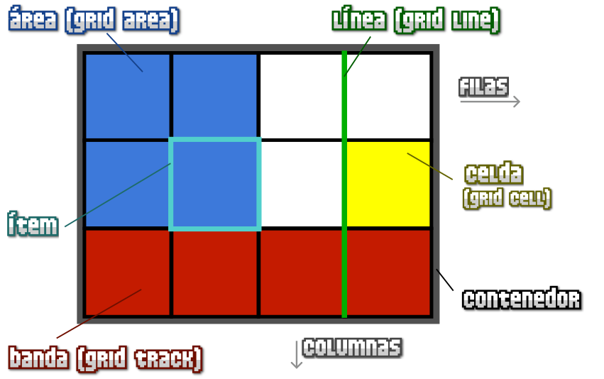
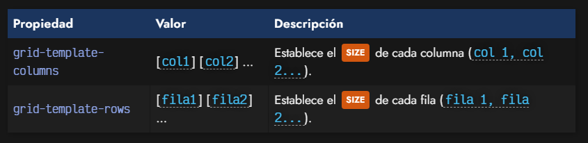
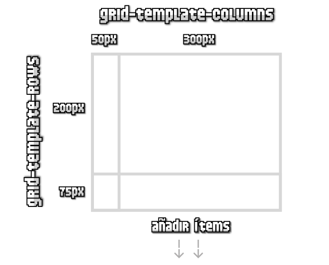
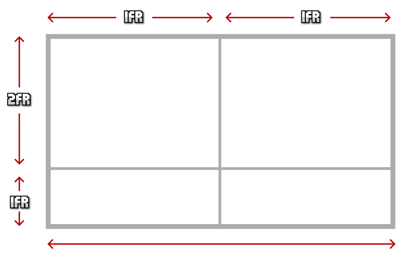
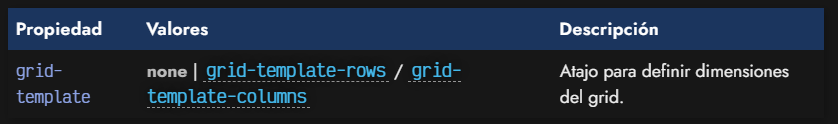
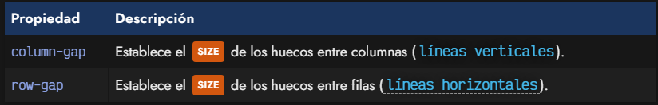

# Conceptos

Para crear diseños basados en Grid CSS necesitaremos tener en cuenta una serie de conceptos que utilizaremos a partir de ahora y que definiremos a continuación:



- Contenedor: El elemento padre contenedor que definirá la cuadrícula o rejilla.
- Ítem: Cada uno de los hijos que contiene la cuadrícula (elemento contenedor).
- Celda (grid cell): Cada uno de los cuadritos (unidad mínima) de la cuadrícula.
- Area (grid area): Región o conjunto de celdas de la cuadrícula.
- Banda (grid track): Banda horizontal o vertical de celdas de la cuadrícula.
- Línea (grid line): Separador horizontal o vertical de las celdas de la cuadrícula.

# Modalidades de grid

Para utilizar cuadriculas Grid CSS, trabajaremos bajo el siguiente escenario:

```HTML
<div class="grid"> <!-- contenedor -->
  <div class="item item-1">Item 1</div> <!-- cada uno de los ítems del grid -->
  <div class="item item-2">Item 2</div>
  <div class="item item-3">Item 3</div>
  <div class="item item-4">Item 4</div>
</div>
```

Para activar la cuadrícula grid hay que utilizar sobre el elemento contenedor la propiedad display y especificar uno de los dos valores que queramos utilizar: grid o inline-grid.

## Tipo de elemento

### inline-grid

Establece una cuadrícula con ítems en línea, de forma equivalente a inline-block.

### grid

Establece una cuadrícula con ítems en bloque, de forma equivalente a block.

Este valor influye en como se comportará la cuadrícula con el contenido exterior. El primero de ellos permite que la cuadrícula aparezca encima/debajo del contenido exterior (en bloque) y el segundo de ellos permite que la cuadrícula aparezca a la izquierda/derecha (en línea) del contenido exterior (ojo, la cuadrícula entera, no cada uno de sus ítems):

# Definir filas y columnas

### Filas y columnas fijas

En Grid CSS, la forma principal de definir una cuadrícula es indicar el tamaño de sus filas y sus columnas de forma explícita. Para ello, sólo tenemos que usar las propiedades CSS grid-template-columns y grid-template-rows:



Conociendo estas dos propiedades, asumamos el siguiente código CSS:

```CSS
.grid {
  display: grid;
  grid-template-columns: 50px 300px;
  grid-template-rows: 200px 75px;
}
```

Con la propiedad display: grid definimos que queremos crear un grid, y mediante las propiedades grid-template-columns y grid-template-rows definimos los tamaños de las columnas y las filas del mismo. Esto significa que, a priori, tendríamos una cuadricula o grid de 4 celdas en total:



Veamos un ejemplo interactivo donde se pueden cambiar los valores establecidos en la propiedad grid-template-columns y en la propiedad grid-template-rows, para así poder entenderlo mejor:

Ahora, ten en cuenta que corre de nuestra cuenta vigilar que el número de elementos hijos en el grid es el que debería. Dependiendo del número de elementos hijos que tenga definido el contenedor grid en su HTML, tendremos una cuadrícula de 2x2 elementos (4 ítems), 2x3 elementos (6 ítems), 2x4 elementos (8 ítems) y así sucesivamente. Incluso, si el número de ítems es impar (por ejemplo, 5 ítems), la última celda de la cuadrícula se quedaría vacía.

A medida que fueramos incluyendo más ítems en el grid, podríamos aumentar también el número de parámetros de la propiedad grid-template-columns y/o la propiedad grid-template-rows. En caso de tener más ítems de lo que se indica en la propiedad, los ítems restantes se incluirían sin formato. De tener menos, simplemente se ocuparían los ítems implicados.

# Unidad fracción restante (fr)

En el ejemplo anterior he utilizado píxels como unidades de las celdas de la cuadrícula, sin embargo, también podemos utilizar otras unidades (o incluso combinarlas): porcentajes, la palabra clave auto (que obtiene el tamaño restante) o la unidad especial de grid fr (fracción restante), que explicaremos a continuación.

Supongamos el siguiente fragmento de código, donde utilizamos las unidades fr:

```CSS
.grid {
  display: grid;
  grid-template-columns: 1fr 1fr;
  grid-template-rows: 2fr 1fr;
}
```

Este nuevo ejemplo, también crea una cuadrícula de 2x2, donde el tamaño de la cuadrícula se divide en:

- Dos columnas: Mismo tamaño de ancho para cada una.
- Dos filas: La primera fila ocupará el doble (2fr) que la segunda fila (1fr).



De esta forma, es muy fácil predecir el espacio que va a ocupar la cuadrícula, ya que sólo tenemos que sumar todas las unidades para saber el tamaño total, y comparar con cada columna o fila para saber como de grande o pequeña es respecto al total. Así tendremos un mejor control del espacio restante de la cuadrícula, y resultará más intuitivo calcularlo.

Se pueden combinar varias unidades diferentes, como por ejemplo píxeles (px), fracciones restantes (fr), porcentajes (%) y otras combinaciones similares

# Filas y columnas repetitivas

En algunos casos, en las propiedades grid-template-columns y grid-template-rows podemos necesitar indicar las mismas cantidades un número alto de veces, resultando repetitivo y molesto escribirlas varias veces. Se puede utilizar la función repeat() para indicar repetición de valores, señalando el número de veces que se repiten y el tamaño en cuestión.

La expresión a utilizar sería la siguiente: repeat(número de veces, tamaño):

```CSS
.grid {
  display: grid;

  grid-template-columns: 100px repeat(4, 50px) 200px;
  grid-template-rows: repeat(2, 1fr 2fr);

  /* Equivalente a... */
  grid-template-columns: 100px 50px 50px 50px 50px 200px;
  grid-template-rows: 1fr 2fr 1fr 2fr;
}
```

Asumiendo que tuvieramos un contenedor grid con 24 ítems hijos en el HTML, el ejemplo anterior crearía una cuadrícula con 6 columnas y 4 filas. Recuerda que en el caso de tener más ítems hijos, el patrón se seguiría repitiendo.

# Función minmax()

La función minmax() se puede utilizar como valor para definir rangos flexibles de celda. Funciona de la siguiente forma:


Si establecemos un rango, por ejemplo, grid-template-column: minmax(200px, 500px), estaremos indicando que la celda de columna indicada, tendrá un tamaño de 500px, salvo que redimensionemos la ventana del navegador y la hagamos más pequeña, en cuyo caso, el tamaño de la celda podría ir disminuyendo hasta 200px, medida en la cuál se quedaría como mínimo.

Prueba con este ejemplo, y prueba a redimensionar la ventana del navegador:

``` CSS
.container {
  display: grid;
  grid-template-columns: repeat(2, minmax(400px, 600px));
  grid-template-rows: repeat(2, 1fr);
  gap: 5px;
}

.item {
  background: black;
  color: white;
  padding: 1em;
}
```

Comprobarás que las celdas se hacen más pequeñas hasta un punto en el que se alcanza el mínimo.

# Los valores auto-fill y auto-fit
En la función repeat() es posible utilizar las palabras claves auto-fill o auto-fit para indicar al navegador que queremos que rellene o ajuste el contenedor grid con múltiples elementos hijos dependiendo del tamaño del viewport (región visible del navegador).

Es decir, si utilizamos repeat(auto-fill, minmax(300px, 1fr), el navegador se va a encargar de que los elementos hijos con el tamaño mínimo quepan en la primera fila, y los que no quepan, se desplacen a las siguientes filas del grid, de modo que se aproveche lo mejor posible el contenedor, y consigamos un efecto similar al que se consigue con media queries, pero de una forma más directa y con menos código.

Imagina el siguiente ejemplo, con un grid con 10 ítems:

``` CSS
.grid {
  display: grid;
  grid-template-columns: repeat(auto-fill, minmax(300px, 1fr));
  background: grey;
  gap: 10px;
}

.item {
  background: blue;
  color: #fff;
  font-size: 2rem;
}
```

``` HTML
<div class="grid">
  <div class="item">Item</div>
  <div class="item">Item</div>
  <div class="item">Item</div>
  <div class="item">Item</div>
  <div class="item">Item</div>
  <div class="item">Item</div>
</div>
```

Si cambiamos el ejemplo anterior a auto-fit no veremos ninguna diferencia. Sin embargo, si por ejemplo cambiamos el valor mínimo de 300px a 50px (de modo que no llegue a cubrir la primera fila completamente), comprobaremos que mientras auto-fill va rellenando la fila del grid y deja el resto del espacio libre, auto-fit ajusta el tamaño de los ítems para que cubran el tamaño máximo de la fila.

# Atajo: La propiedad grid-template
Si acostumbras a utilizar estas propiedades frecuentemente, puedes utilizar la propiedad grid-template, que sirve de atajo para muchas cosas, y una de ellas, resumir en una sola propiedad los valores que tenemos en grid-template-columns y en grid-template-rows:



Esta propiedad convierte en un proceso bastante cómodo el crear grids de unas dimensiones concretas de forma resumida. En el caso de utilizar el valor none, las propiedades grid-template-rows, grid-template-columns y la propiedad grid-template-areas, que veremos más adelante en el tema de Grid por áreas, se establecen a sus valores por defecto, desactivando su funcionamiento.

En el caso de utilizar unos valores definidos, la propiedad grid-template-areas se establecerá a none.

# Huecos en grid

Por defecto, la cuadrícula tiene todas sus celdas pegadas a sus celdas contiguas. Aunque sería posible darle un margin a las celdas dentro del contenedor, existe una forma más apropiada: los huecos (gutters).

Para especificar los huecos (espacio entre celdas) podemos utilizar las propiedades column-gap y/o row-gap. En ellas indicaremos el tamaño de dichos huecos:



Observa el siguiente grid irregular de ejemplo. No te preocupes por la estructura, más adelante veremos como hacerla. En él, le indicamos estas dos propiedades para colocar huecos entre las celdas de la cuadrícula.

El código sería el siguiente:

``` css
.grid {
  column-gap: 100px;
  row-gap: 10px;
}
```

Con la primera propiedad column-gap, establecemos un hueco de 100px entre celda y celda que se encuentre en columna, mientras que con la propiedad row-gap establecemos un hueco de 10px entre celda y celda que se encuentre en fila. Nos quedaría algo similar a esto:


# Atajo: Grid con huecos
De la misma forma que habrás visto en flex, existe una propiedad de atajo para las propiedades column-gap y row-gap, que nos permite la posibilidad de no tener que indicar las propiedades por separado. La propiedad en cuestión sería gap y se utilizaría de la siguiente forma:

``` CSS
.grid {
  /* gap: <row-gap> <column-gap> */
  gap: 20px 80px;
  /* Equivalente a... */
  row-gap: 20px;
  column-gap: 80px;

  gap: 40px;
  /* Equivalente a... */
  row-gap: 40px;
  column-gap: 40px;
}
```
```
OJO: Antiguamente, las propiedades column-gap, row-gap y gap eran conocidas como grid-column-gap, grid-row-gap y grid-gap, por lo que aún puede que encuentres información obsoleta que las mencione. Hoy en día deberías utilizar las tres primeras en su lugar.
```