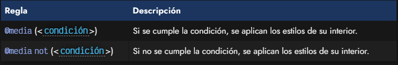
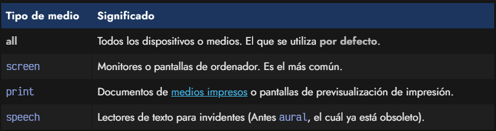
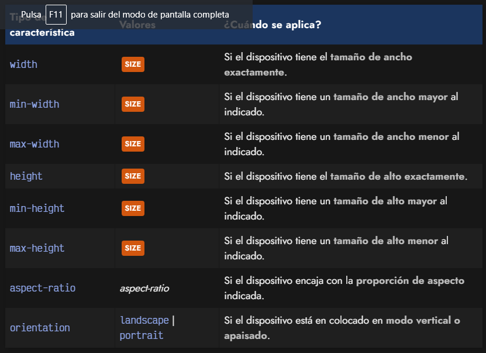
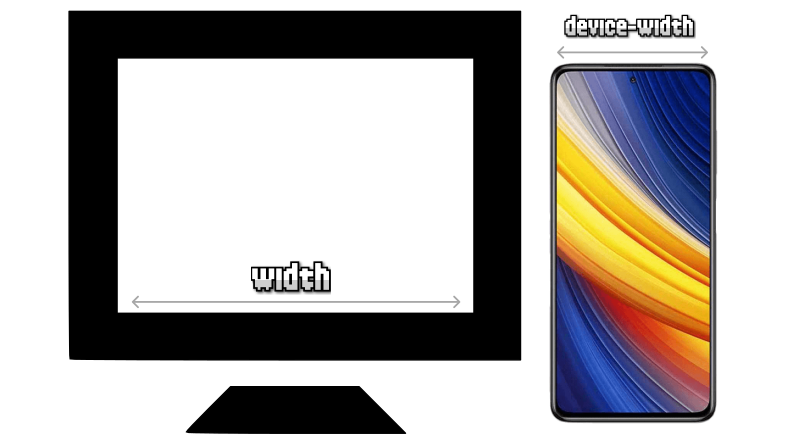

# CSS Media Queries

Una vez nos adentramos en el mundo del Responsive Design, nos damos cuenta en que hay situaciones en las que determinados aspectos o componentes visuales deben aparecer con ciertas diferencias dependiendo del dispositivo donde se están visualizando, ya que no todos los dispositivos tienen los mismos tamaños o características.

Por ejemplo, una zona donde se encuentra el buscador de la página puede estar colocada en un sitio concreto en la versión de escritorio, pero en móvil quizás nos interese que ocupe otra zona (o que tenga otro tamaño o forma) para aprovechar mejor el espacio de la versión del dispositivo móvil.

### ¿Qué son las Media Queries?

Existe un concepto denominado media queries, mediante el cuál podemos hacer excepciones para que unos determinados estilos de diseño sólo se apliquen si se cumplen una serie de condiciones, generalmente relacionadas con el dispositivo mediante el cuál se está viendo la página.

### La regla @media

Las reglas media queries (también denominadas MQ a veces) son un tipo de reglas de CSS que permiten crear un bloque de código que sólo se procesará en los dispositivos que cumplan los criterios especificados como condición.

La sintaxis de la regla @media es la siguiente:



Básicamente, se trata de establecer una condición que se aplicará a la página actual, y en el caso de cumplirse, se aplicarán los estilos indicados en su interior. De no cumplirse, no se aplicarán. Si utilizamos la keyword not antes de la condición, se invierte la condición:

```CSS
@media (*condición*) {
  .container {
    background: green;
  }
}

@media not (*condición*) {
  .container {
    background: red;
  }
}
```

En el ejemplo anterior, si se cumple la condición establecida, se aplicará un color verde. Sin embargo, si no se cumple, se aplicará un color rojo. Observa que es similar al funcionamiento de un if / else en programación.

```
No olvides que si tenemos estilos de .container fuera de las reglas @media podrían sobreeescribir los estilos dependiendo de si están antes o después de las reglas y de la especificidad de sus selectores.
```

### Condiciones múltiples con @media

Si lo deseas, es posible establecer múltiples condiciones en las reglas @media. De esta forma, se pueden conseguir situaciones mucho más específicas y flexibles. Ten mucho cuidado si aplicas el not en las condiciones, no sea que niegues de forma incorrecta los casos deseados:

```CSS
@media (*condición*) and (*condición) {
  .container {
    background: orangered;
  }
}
```

```
Al igual que not, también existe una palabra clave only que, suele usarse a modo de hack. El comportamiento por defecto ya incluye los dispositivos que encajan con la condición, pero con la palabra clave only conseguimos que navegadores antiguos que no la entienden, no procesen la información, dejándola sólo para navegadores modernos.
```

### Tipos de medios

En algunas ocasiones, queremos indicar que las reglas @media sólo se pongan en funcionamiento en determinados tipos de dispositivos. Son los llamados tipos de medios. Existen los siguientes:



Estos tipos de medios se pueden indicar como una condición más, de modo que podría quedar de la siguiente forma:

```CSS
@media screen and (*condición*) {
  /* ... */
}

@media print {
  /* ... */
}
```

Quizás encuentres referencias a tipos de medios como braille, embossed, handheld, projection, tty o tv. Aunque aún sirven, están marcados como obsoletos a favor de usar los de la lista anterior.

### Condiciones de Media Queries

En los ejemplos anteriores hemos indicado _condiciones_ en el interior de los paréntesis, pero no hemos visto como definir ninguna. Vamos a echar un vistazo a que tipo de características podemos definir en las condiciones de los media queries.

Podemos utilizar las siguientes:


Existen otras características que en algunos casos pueden ser interesantes, como por ejemplo scan, update, resolution, monochrome, grid, color-index, color, color-gamut, dynamic-range, etc...

```CSS
.container {
  background: grey;
  height: 100px;
}

@media (max-width: 800px) and (orientation: landscape) {
  .container {
    background: red;
  }
}

```

```HTML
<div class="container"></div>

```

El ejemplo anterior, establecerá el elemento .container con fondo rojo cuando se cumpla la condición de que la página esté siendo visualizada desde un dispositivo con una pantalla de 800px de ancho como máximo y tenga un sensor que indique está en modo apaisado.

### Ejemplos básicos

Veamos un ejemplo clásico de media queries en el que definimos diferentes estilos dependiendo del dispositivo que estamos utilizando. Observese que en el código existen 3 bloques @media donde se definen estilos CSS para cada uno de esos tipos de dispositivos.

El código sería el siguiente:

```CSS
.menu {
    height: 100px;
}

@media (max-width: 400px) {
    .menu {
        background: blue;
    }
}

@media (min-width: 400px) and (max-width: 800px) {
    .menu {
        background: red;
    }
}

@media (min-width: 800px) {
    .menu {
        background: green;
    }
}
```

```HTML
    <div class="menu"></div>
```

El ejemplo anterior muestra un elemento (con clase menu) con un color de fondo concreto, dependiendo del tipo de medio con el que se visualice la página. Los resultados podrían ser los siguientes (los valores son sólo ejemplos, habría que adaptarlos al caso deseado):

* Azul para resoluciones menores a 400 píxeles de ancho (móviles).
* Rojo para resoluciones entre 400 píxeles y 800 píxeles de ancho (tablets).
* Verde para resoluciones mayores a 800 píxeles (desktop).

```
El número de bloques de reglas @media a utilizar depende del desarrollador web, ya que no hay una obligación o norma de utilizar un número concreto. Se pueden utilizar desde un sólo media query, hasta múltiples de ellos a lo largo de todo el documento CSS.
```

### Media Query Range Syntax
Aunque la forma de definir condiciones anterior es útil, a menudo resulta confusa y difícil de escribir. Es posible utilizar una modalidad denominada rangos de condiciones, que son algo más versátiles que las anteriores y mucho menos tediosas.

La diferencia radica en que se puede utilizar operadores matemáticos que harán que las condiciones sean mucho más legibles y fáciles de interpretar. Veamos el mismo ejemplo anterior con sintaxis de rangos:

```CSS
.menu {
  height: 100px;
}

@media (width <= 400px) {
  .menu {
    background: blue;
  }
}

@media (400px <= width <= 800px) {
  .menu {
    background: red;
  }
}

@media (width >= 800px) {
  .menu {
    background: green;
  }
}
```

Como puedes ver, al poder utilizar los operadores >, >=, <, <= en las condiciones, se hace mucho más intuitivo el determinar las condiciones de los media queries. Sin embargo, ten en cuenta que si necesitas compatibilidad con navegadores muy antiguos, podrían no tener soporte.


### Viewport (Región visible)
Cuando hablamos de Responsive Design muchas veces haremos referencia al viewport (región visible del navegador). Recordemos que con el siguiente fragmento de código HTML estamos indicando que hay que preparar el navegador para el Responsive y que el nuevo ancho de la pantalla será el ancho del dispositivo, por lo que el aspecto del viewport se va a adaptar consecuentemente:

```HTML
<meta name="viewport" content="initial-scale=1, width=device-width">
```


Responsive Web Design: La variable device-width

Con esto conseguiremos preparar nuestra web para dispositivos móviles y prepararnos para la introducción de reglas media query en el documento CSS. Es importante no olvidar este paso.

### Media Queries desde HTML
Por último, hay que tener en cuenta que los media queries también es posible indicarlos desde HTML, utilizando la etiqueta <link> y el atributo media para establecer la condición:

```HTML
<link rel="stylesheet"
      href="mobile.css"
      media="(max-width: 640px)">

<link rel="stylesheet"
      href="tablet.css"
      media="(min-width: 640px) and (max-width: 1280px)">

<link rel="stylesheet"
      href="desktop.css"
      media="(min-width: 1280px)">
```

Observa, sin embargo, que en este caso, el código CSS de las diferentes condiciones queda en un archivo .css diferente, sin embargo, el navegador al cargar la página los descargará todos y los aplicará cuando sea necesario, al igual que lo hace en los ficheros .css.
