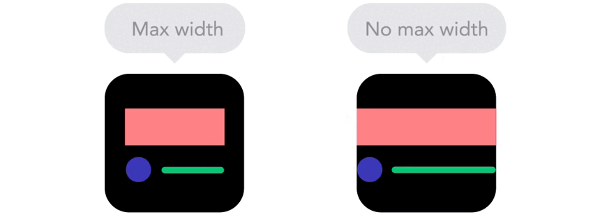
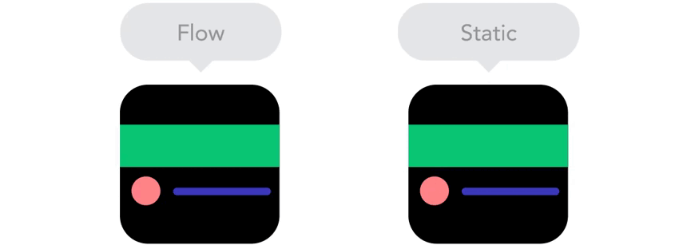

# ¿Qué es Responsive Design?

En la actualidad, el uso de todo tipo de dispositivos móviles se ha disparado, no sólo de «smartphones», sino también de tablets, «smartwatchs», lectores de ebooks y múltiples tipos de dispositivos con capacidad de conexión a Internet.

Cada vez es más frecuente acceder a Internet con diferentes tipos de dispositivos, que a su vez tienen diferentes pantallas y resoluciones, con distintos tamaños y formas, que hacen que se consuman las páginas webs de formas diferentes, apareciendo por el camino también diferentes necesidades, problemas y soluciones.


Por lo tanto, en la actualidad, cuando diseñamos una web, esta debe estar preparada para verse correctamente en diferentes resoluciones, cosa que, a priori no es sencilla. Antiguamente, se llegó al punto de preparar una web diferente dependiendo del dispositivo o navegador que utilizaba el usuario, pero era algo que se terminó descartando, ya que no era práctico.

Por suerte, esos tiempos han quedado atrás, y la máxima que se sigue hoy es diseñar una sola web, que se adapte visualmente al dispositivo utilizado.

Hoy en día se le denomina Responsive Web Design (o RWD) a los diseños web que tienen la capacidad de adaptarse al tamaño y formato de la pantalla en la que se visualiza el contenido, respecto a los diseños tradicionales en los que las páginas web estaban diseñadas sólo para un tamaño o formato específico, y no tenían esa capacidad de adaptación.

Aunque en principio el concepto de web adaptativa es muy sencillo de comprender, aplicarlo puede ser todo un quebradero de cabeza si no se conocen bien las bases y se adquiere experiencia. En MediaQueri.es puedes encontrar algunos ejemplos de páginas que utilizan Responsive Web Design para tener clara la idea.

### Conceptos básicos

#### Responsive vs Adaptative

El primero de ellos es la diferencia entre diseño responsivo y diseño adaptativo. Como se puede ver en la imagen a continuación, un diseño responsive responde (valga la rebuznancia) en todo momento a las dimensiones del dispositivo, mientras que un diseño adaptable es aquel que se adapta, pero no necesariamente responde en todo momento:


```
Veremos que esto puede ser la diferencia entre aplicar correctamente conceptos como media queries, porcentajes y propiedades de ancho máximo y mínimo, que veremos más adelante.
```

### Unidades relativas vs estáticas 

Por otro lado, para trabajar correctamente en diseños responsive hay que tener en cuenta que debemos trabajar con unidades relativas e intentar evitar las unidades fijas o estáticas, las cuales no responden a la adaptación de nuestros diseños flexibles:


### Con máximos y sin máximos
Otra forma interesante de trabajar esa respuesta de los diseños responsive es utilizar propiedades como min-width o max-width, donde definimos tamaños mínimos o máximos, para que los elementos de nuestra página puedan ampliar o reducirse según sea necesario dependiendo de la pantalla del dispositivo utilizado.

Con estas propiedades podemos crear diseños que aprovechen al máximo toda la pantalla de dispositivos pequeños (como móviles o tablets), mientras que establecemos unos máximos en pantallas de dispositivos grandes, para crear unos espacios visuales que hacen que el diseño sea más agradable:

### Flujo vs Estático
Otro concepto, que a la misma vez es una característica muy atractiva en nuestros diseños responsive es la de mantener el flujo de los elementos cuando cambian de tamaño y evitar que estos se solapen unos con otros.

Si estamos habituados a trabajar en diseños más estáticos que no están preparados para móviles, suele ser duro hacer ese cambio. Sin embargo, una vez lo conseguimos, todo resulta mucho más fácil y conseguiremos transmitir una buena respuesta y fluidez visual:


### Con breakpoints vs sin breakpoints
Esto último va muy de la mano del sistema habitual de recolocación de elementos que se suele seguir en los diseños Responsive Design. Como se puede ver en la siguiente imagen, en un diseño responsive se utilizan ciertos «puntos de control».

Por ejemplo, se suele pensar que en una resolución de escritorio queremos mostrar la información dentro de una cuadrícula (grid) de 4 ó 5 celdas de ancho, mientras que en la versión de tablet será sólo de 3 celdas de ancho (el resto se desplazará a la siguiente fila) y en móviles será una sola celda de ancho, mostrándose el resto de celdas haciendo scroll hacia abajo:

Esta forma de trabajar nos proporciona múltiples ventajas:

Es mucho más sencillo mostrar la misma información desde diseños de pantalla grande.
Ayuda a evitar la mala práctica de ocultar bloques de información en dispositivos móviles.
Incentiva a diseñar siguiendo buenas prácticas para facilitar la creación responsive.
# Preparación previa
Antes de comenzar a crear un diseño web preparado para móviles, es importante tener claro ciertos detalles:

A priori, ¿Cuál es tu público objetivo? ¿móvil o escritorio? ¿ambos?

Debes conocer las resoluciones más utilizadas por tu público potencial

Debes elegir una estrategia acorde a los datos anteriores
En primer lugar, es importante conocer los formatos de pantalla más comunes con los cuales nos vamos a encontrar. Podemos consultar páginas como MyDevices, la cuál tiene un apartado de comparación de dispositivos, donde se nos muestra un listado de dispositivos categorizados en smartphones, tablets u otros dispositivos con las características de cada uno: dimensiones de ancho, alto, radio de píxels, etc...

Una vez estés familiarizado con estos detalles, es importante conocer el público de tu sitio web. ¿Acceden más usuarios desde móvil o desde escritorio? ¿Predominan las tablets o los móviles? ¿Tu objetivo es tener más usuarios de móvil o de escritorio?

Consulta con algún sistema de estadísticas como Google Analytics para comprobar que tipo de público tienes actualmente. También es aconsejable echar un vistazo a información externa como las que nos proporcionan estadísticas globales anónimas de Global StatCounter, para hacernos una idea de los atributos más comunes.

# Estrategias de diseño
Por último, es aconsejable decidirse por una estrategia de diseño antes de comenzar. Aunque existen otras estrategias, las dos vertientes principales más populares son las siguientes:

### Estrategia	Descripción
Mobile first	Primero nos enfocamos en dispositivos móviles y luego pensamos en otros.
Desktop first	Primero nos enfocamos en dispositivos de escritorio, y luego pensamos en otros.
### Mobile-first
La estrategia Mobile-first es la que utilizan los diseñadores de sitios webs en las que su público objetivo es mayoritariamente usuario de móvil. Ejemplos como una web para comprar billetes de transporte, la web de un juego o aplicación móvil o una web para pedir cita en un restaurante podrían ser, a priori, una buena elección para utilizar Mobile-first.
```
Esta estrategia hace que el desarrollo en escritorio sea muy sencillo, ya que se reduce a tener un diseño de móvil en escritorio e ir añadiendo nuevas secciones o partes para «completar» el diseño en resoluciones grandes.
```

### Desktop-first
Por otro lado, la estrategia Desktop-first suele interesar más a los diseñadores de sitios webs en las que el público objetivo son usuarios de escritorio. Por ejemplo, una página de una aplicación para PC/Mac o similares, podría ser una buena opción para la estrategia Desktop-first.

En ella, hacemos justo lo contrario que en la anterior, lo primero que diseñamos es la versión de escritorio, y luego vamos descargando detalles o recolocando información hasta tener la versión para dispositivos móviles.